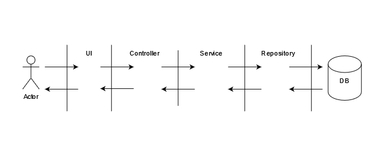

## About this project

This is a simple CMS project.

In this project i have tried to use repository pattern and also i separated the controllers and services.

In this architecture i see the services and repositories as layers not just classes or interfaces.

<br />

<div  align="center">
  

  
</div>

<br />

Our project business logic is in service layer and we use repositories for all of our actions with data & database.

Note : We don't have the jump between the layers.

<b>Note : I know that this project is a small project and we don't need this complex structure but i just wanted to show this architecture and this approach of coding in a laravel project</b>


## Install:
Clone Repository and install Composer
</div>

```php
git clone https://github.com/HosseinKalateh/laravel-service-repository.git
```

```php
composer install
```

<p>Config database in .env file then migrate</p>

```php
php artisan migrate
```

## Usage
Serve project 

```php
php artisan serve
```

**How to log in as admin:**

> *http(s)://example.com/panel/login*

~~~
email:admin@cms.com
password:admin@123
~~~

